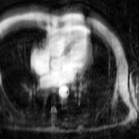

# Learning Regularization Parameter-Maps with NNs

Here, we provide code for our paper 

"Learning Regularization Parameter-Maps for Variational Image Reconstruction using Deep Neural Networks and Algorithm Unrolling"
https://arxiv.org/abs/2301.05888

by A. Kofler, F. Altekrüger, F. A. Ba, C. Kolbitsch, E. Papoutsellis, D. Schote, C. Sirotenko, F. F. Zimmermann, K. Papafitsoros.

The paper presents a Neural Networks (NNs)-based method to learn spatio-temporal pixel/voxel dependent and data-adaptive regularization parameter-maps to be used for variational image reconstruction. In the paper, we use total variation (TV)-minimization as the regularization method of choice.

## The Method 
The overall approach works as follows. The NN consists of two sub-networks. In the first step, we estimate a regularization parameter-map  from an input image  with  the first sub-network, i.e. ), where  denotes a CNN, e.g. a U-Net. Then, we use the obtained regularization parameter-map  to formulate the reconstruction problem

which we then (approximately) solve with an unrolled iterative scheme of finite length, e.g. the primal dual hybrid gradient (PDHG) method, which constitutes the second sub-network. 

The weights of the network, i.e. the weights of the CNN which provide the regularization parameter-maps as well as other potential parameters as step sizes, can then be learned on a set of input-targe image pairs. Thereby, the CNN learns to estimate appropriate regularization parameter-maps such that the TV-reconstruction is as close as possible to the corresponding target image. In contrast to other methods, we do not need access to target regularization parameter-maps. 

Below, you can see exemplary results for a 2D dynamic MR image reconstruction problem. The regularization parameter-map  is constructed as  ), i.e. it consists of two spatial components  (which are constraint to be equal) for the derivatives in the spatial - and -direction and a temporal component  for the derivative in the temporal -direction. The regularization parameter-maps denote the voxel-dependent strength of the gradient-sparsity in the spatial and temporal directions which is imposed on the image, respectively.

From left to right: 

Zero-filled reconstruction - TV-reconstruction - spatial component  - temporal component of  - ground-truth target image:

     
   
## Code and Applications

You will find code for the applications shown in the paper, i.e.
- 2D dynamic cardiac MRI
- 2D dynamic image denoising
- quantitative MRI (T1-mapping in the brain)
- 2D low-dose CT

We are currently cleaning and preparing the code for publication. Please forgive the time delay.

## Citation and Acknowledgement

If you use the code for your work or if you found the code useful, please cite the following:

@article{kofler2023learning,
  title={Learning Regularization Parameter-Maps for Variational Image Reconstruction using Deep Neural Networks and Algorithm Unrolling},
  author={Kofler, Andreas and Altekr{\"u}ger, Fabian and Ba, Fatima Antarou and Kolbitsch, Christoph and Papoutsellis, Evangelos and Schote, David and Sirotenko, Clemens and Zimmermann, Felix Frederik and Papafitsoros, Kostas},
  journal={arXiv preprint arXiv:2301.05888},
  year={2023}
}

